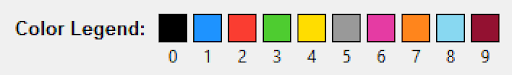
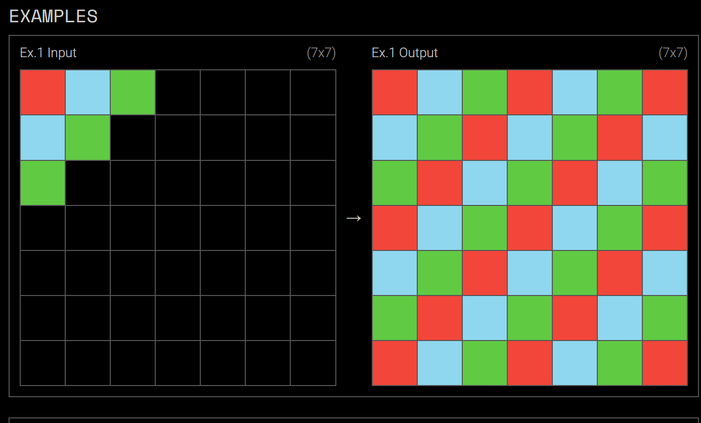
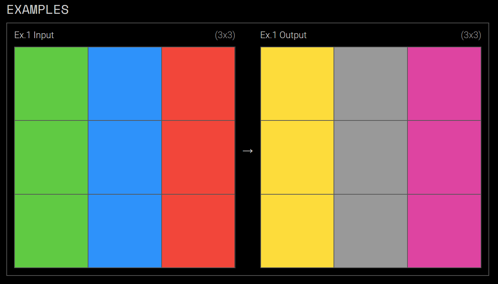
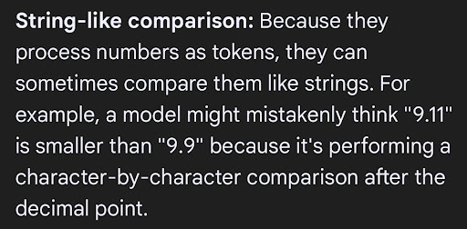
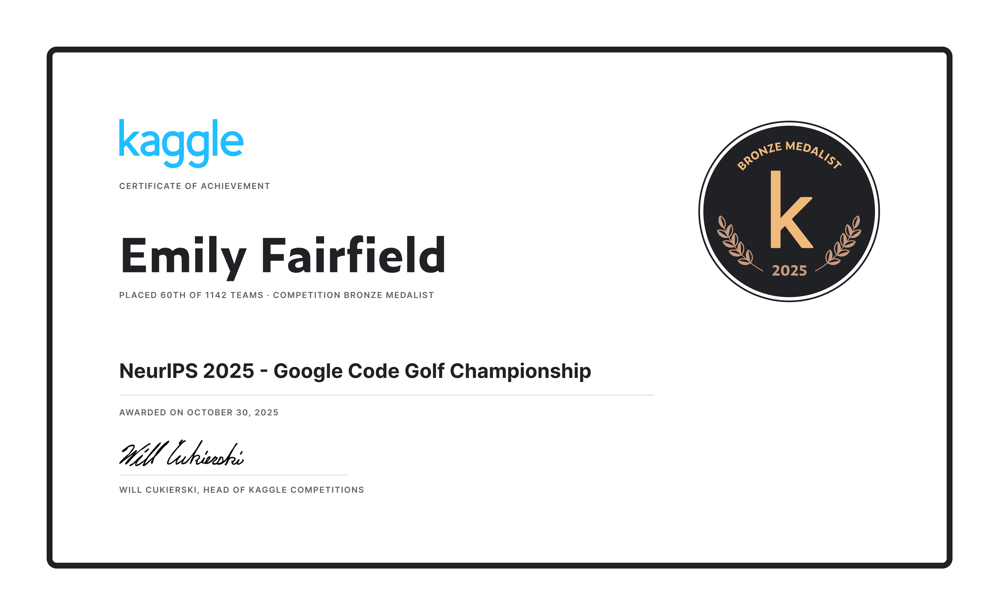

# We Used LLMs to Win a Coding Contest Bronze Medal, with Some Crucial Guard Rails

The goal of the NeurIPS 2025 - Google Code Golf Championship (hosted on Kaggle) was to write 400 Python scripts - each solving a different 2-D grid transformation task - using the fewest Python characters (and using only the standard Python library).

The “using the fewest characters” part of this challenge, while intriguing, contradicted everything we learned in our computer science programs about code maintainability, modularity, and edge case handling. 

Nonetheless, it sounded fun. So we did it.

For each of the 400 tasks, the competition sponsors provided input / output pairs, such that our code was expected to transform each input into its associated output. The grids were represented as lists of lists containing the numbers 0-9, with each number representing a different color, according to the following legend:

 

For example, below is task 7 of 400. We can see that we are supposed to write code that continues the pattern to fill the entire input space: 

  

[https://arcprize.org/play?task=05269061]  

Other desired patterns were not so clear at first glance, as in Task 16 below:  
  
[https://arcprize.org/play?task=0d3d703e]

(It turns out that this ‘transformation’ was simply a one-to-one hardcoded mapping from input color to output color, with no mathematical formula or reasoning behind the mapping).

After checking (and re-checking) the rules, we decided to try using LLMs (including Claude, ChatGPT, Copilot, and Grok) to help us. Here’s what we learned:

## You can actually have an LLM generate its own prompt.  

Several times, we asked “Help me identify/describe the transformation by looking at the example inputs and outputs”. Regardless of whether we were having trouble figuring out the transformation, this prompt helped describe the transformation in the LLM’s own words, which we surmised would help it write better code. (It sometimes missed details, so human review was crucial here.)

(With the help of an LLM), we generated the following simple python GUI for filling in boilerplate prompt language with task-specific information:

Upon clicking “Generate Prompt”, it prints the following prompt into a textbox, complete with a “Copy to Clipboard” button for easy copying and pasting into an LLM:

    I'm competing in a Python golf competition (where the goal is to write code that accomplishes a given task using the minimum number of characters).
    
    Write Python code for me that takes as input a 2-dimensional grid (as a list of lists) and produces as output a 2-dimensional grid (as a list of lists or tuple of tuples) where the only possible input/output dimension combinations are:
    
    7x7 -> 7x7
    
    The input grid's values are integers that each represent a color from the set { 0=black, 1=blue, 2=red, 3=green, 4=yellow, 5=gray, 6=pink, 7=orange, 8=light blue, 9=brown }.
    
    The output grid's values are integers that each represent a color from the set { 1=blue, 2=red, 3=green, 4=yellow, 5=gray, 6=pink, 7=orange, 8=light blue, 9=brown }.
    
    The function should transform the input as follows:  
    
    continue the diagonal pattern observed in the input downward and to the right such that it fills the entire space, replacing all black (0) background cells with non-zero cells.
    
    The code may transform the input in place or create a new list of lists or tuple of tuples, whichever can be done with the fewest characters.
    
    The code should be contained in a function (or lambda function) named "p", with grid argument "g".
    
    The code will never be expected to handle any grid sizes or colors/values other than those explicitly outlined here, so hardcoding such values is acceptable.
    
    Run time and memory are not concerns.
    
    The only concern is minimal characters in the code.
    
    Use only the standard Python library.
    
    Write this code to 'Work/task007.py'.”

Almost all of this prompt is boilerplate language. The output file name is based upon the user-provided task name, and the task description is exactly what the user inputs.  

For each of the 400 tasks, the competition sponsors provided all input / output pairs we would ever encounter, so we didn’t have to account for edge cases (and trying to do so would needlessly waste precious characters). So we looked for numbers we could hard code / assumptions we could bake in related to size of input and output grids. This led to the input/output dimensions and colors part of the prompt, which is automatically generated by the code, which looks through the designated task input/output pairs and generates all pairs of (input size, output size) it saw.

We used a lot of follow-on prompts for the tasks, but this was often a good starting point.

## When using LLMs for code generation, construct guard rails (which you can actually build using LLMs). 

Because of how they work, LLMs are comically bad at counting. Case in point: I asked Google Gemini why LLMs are bad at counting. This was its response:  

  

“might *mistakenly* think 9.11 is smaller than 9.9”?

Moving on. We knew we would have to do the counting for the LLMs, or give them a foolproof way to do it. We quickly had all 400 tasks solved - which we achieved via an “ensemble” of our code with others’ publicly-available code from the Kaggle discussion forums. Then we went into optimizing mode, trying to reduce characters. 

We established a team workflow whereby we put our latest attempts at the problems in a folder called “Private-Uncompressed”. Then we ran “check_for_improvement.py”, which generated the following GUI:

<video src="./images/check_for_improvement.mp4"></video>  

"Process" did the following:  
1. Stripped extra whitespace from the file.
2. Compressed our working file using 3 different techniques, keeping the smallest of the results, or the original file, if compression increased size (because we had to add a short decompression line at the beginning of the compressed code). Crucially, we had the code "count" the bytes in each file using len(read_bytes(file)).  
2. Checked if the size of the (possibly compressed) new file is smaller than the current best.
3. If 2 was true, tested that all example inputs produced their expected output.
4. If 3 was true, overwrote our files for current best (uncompressed and compressed).

We used Claude Code to write "check_for_improvement.py", and it was extremely easy to do so, with little back-and-forth.

## Ask Your Question From Several Perspectives
1. “Help me identify the transformation by looking at the example inputs and outputs. Then write golf code that does this.”
2. “Read the code that was used to create the input and output pairs and use that to write code that transforms inputs to outputs using the fewest Python characters."
3. “The transformation from input to output is … help me write code golf that does this.”
4. “Read this code that works and try to shorten it.”
5. “Help me rethink the logic entirely… here’s how I would describe the problem…”
6. “Can we do this [logic] instead?”
7. “Explain the code to me, line by line”. Then manually check if we really need every line, remembering we don’t need to account for edge cases here.

## Have one LLM check another’s work and try to improve it.  
This was not too disimilar from human collaboration in that one LLM mightfind a new way of looking at the problem, and the other - no longer stuck - could then improve upon it further.

## LLMs are Strong in Some Areas and Weak in Others
### Areas where LLMs exceeded human ability:

#### Writing support tools. 
AI created a custom visualizer in a fraction of the time that a human could write it. AI was superior over and over again for these tasks, which were characterized by common building blocks such as pixel image generation, JSON reading, and file manipulation.

#### Explaining existing code. 
The denseness and obscurity of the code seemed not to matter.

#### Improving already golfed code syntactically, not semantically. 
It was excellent at removing a few extra characters using  atomic changes to the code. It changed a for loop to a map function, combined lists in the shortest manner, reversed expressions to remove spaces, and others.

### Areas where LLMs sometimes exceeded and sometimes lagged humans:
#### Debugging. 
It often found the problem very quickly, but it could sometimes be overconfident and miss simple bugs.
#### Writing small sub-task golf code from scratch.
Performed tasks like "Using Python code golf techniques, what is the fewest-character way to find the row index of the leftmost nonzero integer in a list of lists of integers?"

### Areas where LLMs did poorly:
#### Counting, of course.
They would often assert that one script was shorter than the other, when the opposite was true. But, our earlier technique for addressing this was satisfactory.

#### Algorithm design from scratch.
When given a blank slate, the LLMs often struggled to produce code that approached that needed by the obscure code golf requirements. Many times it could not generalize from very similar golfed problems. One could interactively instruct the LLM to get it right, but this didn't seem to save time or brainpower for us.

## Conclusions
LLMs / coding assistants are a crucial tool in coders' toolbox now, so we need to learn how to use them responsibly and effectively. 

We approached this contest as more of a learning opportunity than anything else. We did this in just a few months, in our very limited free time, and would not have been able to achieve Bronze status under such conditions without the help of LLMs.

 
